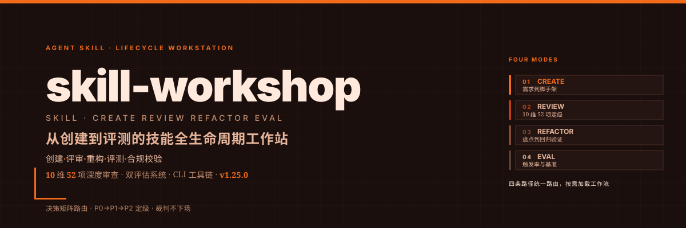

# skill-workshop

<p align="center">
  
</p>

**v2.3.0** · Agent Skill 全生命周期工作台：创建、评审、优化、重构、校验、打包，从明确任务与边界到验证结果形成闭环。

设计原则：最低审查成本发现致命缺陷；**Fast/Deep/Eval**（≡ L0/L1/L2）风险驱动分级；判断框架见 `core-method.md`（Core Task、证据链、规则生命周期、删除优先）；优化方法见 `optimization.md`；规则 HARD / CONDITIONAL / HEURISTIC / EXPERIMENTAL / ARCHIVED。

## 四种模式（职责不混）

| 模式 | 意图 | 路径 | 产出 |
| --- | --- | --- | --- |
| **CREATE** | 做一个新 skill | `references/creation.md` + CLI `init` | SKILL.md 骨架 |
| **AUDIT** | 判断**有没有问题** | Fast/Deep + `references/review.md` | 报告（证据化 findings），**不改文件** |
| **OPTIMIZE** | 理解之后**真正重构** | `references/optimization.md`（全量读 → 目标架构 → 处置表 → 改文件 → 回归） | 改进后的技能 + Before/After |
| **VALIDATE** | 机器结构检查 | CLI `spec` + `validate` | PASS/FAIL（**不判语义质量**） |

> 审计是发现问题，优化是理解后真正重构，校验是机器检查——三者不能混为一谈。
> Eval/评测为条件路径，工具在 `docs/archive/`。

description 的质量不由关键词数量判定：CLI 只查结构（存在、单行、长度、YAML 转义、占位符），触发是否自然、是否堆词属语义判断，走 AUDIT/OPTIMIZE 的 Description 语义评审与 Trigger Quality。

## CLI

```bash
python scripts/skill_cli.py validate /path/to/skill
python scripts/skill_cli.py spec /path/to/skill
python scripts/skill_cli.py init my-skill --path ./output
python scripts/skill_cli.py package /path/to/skill
```

## 用法示例

```text
帮我创建一个处理 PDF 的 Skill
评审一下这个 skill：/path/to/my-skill/
优化这个 skill：结构太散，改完给我 Before/After
校验 skill 规范：/path/to/my-skill/
```

## 自身测试

```bash
python scripts/tests/test_validator.py
```

`unittest`、零第三方依赖；锁住「CLI 只判结构、不再用词法统计代理语义质量」的契约（含裸词表不得因词多得分、自然中文描述不得被判硬错）。改 validator 必须同步用例。

## 文档

| 文件 | 用途 |
| --- | --- |
| [SKILL.md](SKILL.md) | AI 运行时主文档（路由 + 硬约束） |
| [references/core-method.md](references/core-method.md) | 审计判断框架（Core Task、生命周期、删除优先） |
| [references/creation.md](references/creation.md) | 极简创建规范与模板 |
| [references/review.md](references/review.md) | Fast/Deep/Eval、T/E/C、证据格式、P0/P1/P2、报告结构 |
| [references/optimization.md](references/optimization.md) | 优化模式：全量读取、运行机制建模、目标架构、资产处置、重写、回归、Before/After |
| [references/validation.md](references/validation.md) | 格式与安全闸门、N/A |
| [scripts/tests/test_validator.py](scripts/tests/test_validator.py) | validator 自身回归测试（结构契约 + 反词法评分） |
| [CHANGELOG.md](CHANGELOG.md) | 版本史 |
| [docs/integration-2026-09-19.md](docs/integration-2026-09-19.md) | 方法论整合记录与 Before/After |
| [docs/archive/README.md](docs/archive/README.md) | 归档说明（非运行时） |

## 版本对齐

`SKILL.md metadata.version` = `CHANGELOG.md` 顶部 = 仓库根 README 技能索引版本。
