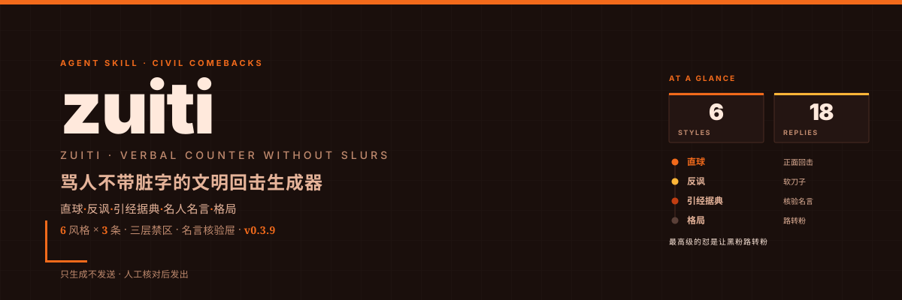

# zuiti（嘴替）

  

> 嘴替者，以言代戈，不血刃而屈人于无形。

替你把话怼回去——骂人不带脏字，默认六风格每风格 3 条、全到齐的体面回法（名人名言内置苏东坡豁达向 / 儒释道三家大能两脉圣言风味）。

## 一句话

你贴一段评论，我替你把话怼回去——骂人不带脏字，默认六风格每风格 3 条、全到齐的体面回法（名人名言内置苏东坡豁达向 / 儒释道三家大能两脉圣言风味）。

## 用途

替用户生成文明、锋利、不翻车的怼人回复。

## 适用范围

用户想回击某条评论 / 私信 / 弹幕 / 群聊但懒得措辞时。

## 怎么用（场景 × 示例提示词）

zuiti 替你把话怼回去——骂人不带脏字，默认六风格各 3 条、全到齐，只生成不代发。下表每行都是你会对它说的话：

| 能力 / 场景 | 一句话方法 | 示例用法提示词 |
| --- | --- | --- |
| 被怼想回击（默认全风格） | 粘评论，默认六风格各 3 条 | `替我怼回去：<粘贴的评论>` |
| 只要某风格 | 指定风格，只给该风格 3 条 | `只要反讽风格的，给我 3 条` |
| 指定强度 | 指定 轻 / 中 / 重，重则锁禁区 | `重一点，但别脏字，怼这条 <评论>` |
| 边界：普通礼貌回复 | 不归本技能，交「回复评论」技能 | `帮我写个礼貌回复。`（交回复评论） |
| 边界：代发机器人 | 不归本技能，只生成不代发 | `自动回复所有评论。`（不归 zuiti） |
| 边界：人身攻击 | 不归本技能（踩禁区不输出） | `帮我写段骂人的话。`（不归，禁区拦截） |

## 设计理念

- 该怼才怼，不怼更高级。
- 忍一时风平浪静，退一步越想越气——但「不回」往往比「回得漂亮」更高级。
- 本技能只生成回复，不替你发送；该不该发、发给谁，由你定。
- 最高级的怼是让黑粉路转粉——拿格局化解，不降格对骂。
- triage（该不该怼）责任在人，技能不替你判断。

## 安全护栏（概览）

- **A2 名言仅核验屉**：引经据典 / 名人名言只取已核验条目，禁止现编出处。
- **A3 不诬人**：不断言任何关于可识别个人的虚假事实——名誉侵权是法律红线。
- **D10 可见闸**：每条输出头部强制 `⚠️ 未过审·发送前请人工核对`。

## 触发方式

用户说：怼人 / 回怼 / 文明炮台 / 骂人不带脏字 / 嘴替 / 替我回一句。

不触发：普通礼貌回复（用「回复评论」技能）、自动回复机器人、平台代发。

## 文件结构

| 文件 | 作用 |
|------|------|
| `SKILL.md` | AI 执行主文档（工作流 + 安全硬规则 + 验证） |
| `references/forbidden-zones.md` | 三层禁区（A 脏字 / B 攻人 / C 引战）+ A3 红线 |
| `references/four-styles.md` | 六风格武器库（直球 / 反讽 / 引经据典 / 名人名言 / 热梗·阴阳 / 格局·路转粉）+ 万能公式 |
| `references/quotes-verified.md` | 名言核验屉（带 `[核验]` + `来源`，禁现编） |
| `references/examples.md` | 已通过禁区筛选的示范 |
| `scripts/validate_skill.py` | 工程硬校验（A2/D10/A3 物理落地） |
| `CHANGELOG.md` | 版本历史（权威源） |

## 版本

当前版本 **v0.3.8**，详见 [CHANGELOG.md](CHANGELOG.md)。
